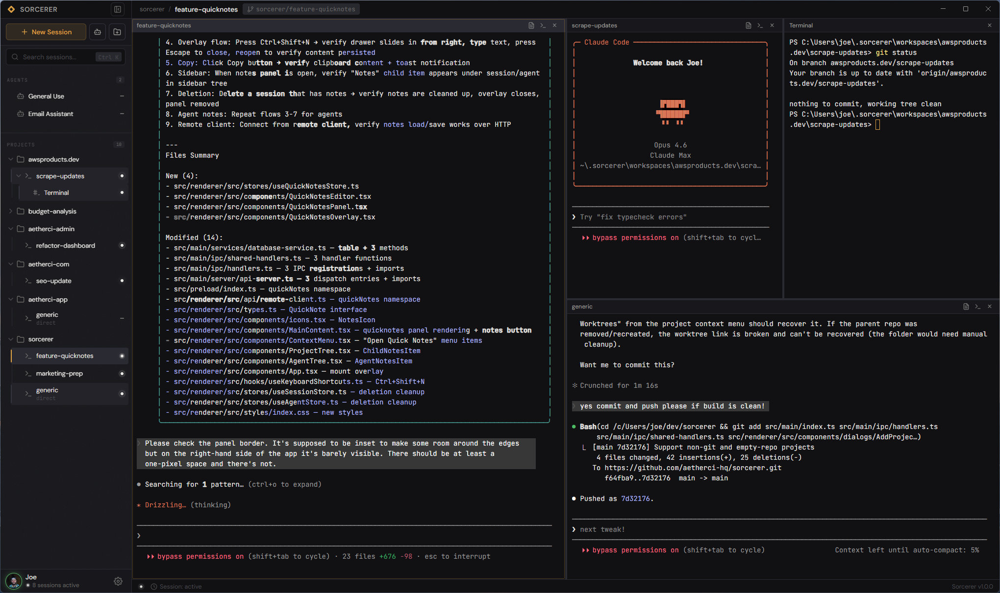

# Sorcerer

Desktop app for orchestrating [Claude Code](https://docs.anthropic.com/en/docs/claude-code) agents. Manage multiple sessions, projects, worktrees, and teams from a single interface.

## Download

Grab the latest release for your platform:

**[Download for Windows, macOS, and Linux](https://github.com/aetherci-hq/sorcerer/releases/latest)**

Requires [Claude Code](https://docs.anthropic.com/en/docs/claude-code) CLI installed and available on PATH.

## Features

- **Multi-session management** — Run multiple Claude Code sessions side-by-side with persistent terminals
- **Project & worktree isolation** — Automatically create git worktrees so each agent works in its own branch
- **Split view** — View and interact with multiple sessions simultaneously
- **Team orchestration** — Monitor Claude Code teams and tasks via filesystem integration
- **Standalone agents** — Launch non-project Claude Code sessions for quick tasks
- **Session recovery** — Resume previous sessions, detect orphaned worktrees, recover from crashes
- **Quick Notes** — Per-session scratchpad that persists across restarts
- **Cross-platform** — Windows, macOS, and Linux

## How it works

Sorcerer wraps Claude Code CLI sessions in native pseudo-terminals (node-pty + xterm.js), manages git worktrees for branch isolation, and watches `~/.claude/teams/` to detect multi-agent coordination. All session data is stored locally in SQLite.

## Built with

Electron, React 19, TypeScript, electron-vite, xterm.js, node-pty, sql.js, Zustand, chokidar, simple-git

## License

[MIT](LICENSE) — Built by [AetherCI](https://aetherci.com)
