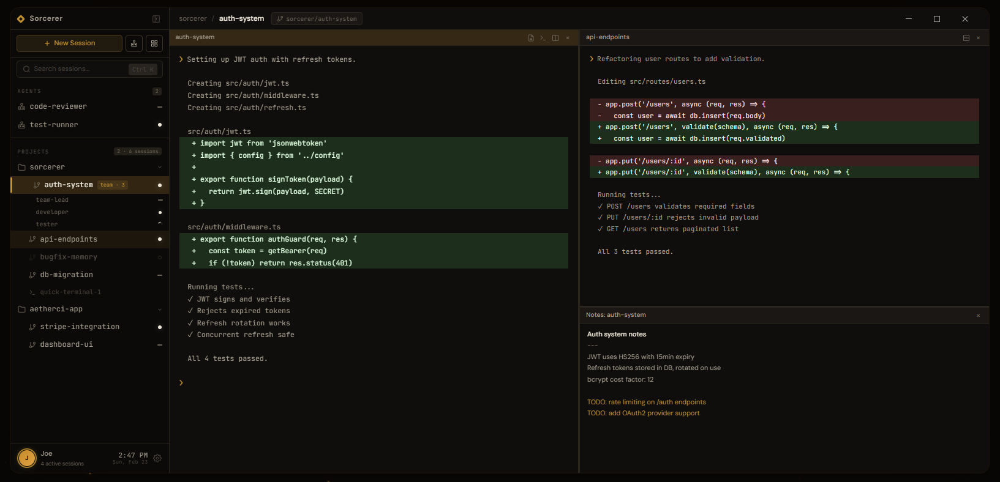

# Sorcerer

The desktop workbench for AI command-line coding tools. Not an IDE — a mission control for the agents that do the work.

## Download

Grab the latest release for your platform:

**[Download for Windows, macOS, and Linux](https://github.com/aetherci-hq/sorcerer/releases/latest)**

Requires an AI CLI tool like [Claude Code](https://docs.anthropic.com/en/docs/claude-code) installed and available on PATH.

> **Windows note:** The installer is not yet code-signed. SmartScreen may show "Windows protected your PC" — click **More info** → **Run anyway** to proceed. macOS users may need to right-click → Open on first launch.

## Features

- **Multi-session management** — Run multiple AI agent sessions side-by-side with persistent terminals
- **Project & worktree isolation** — Automatically create git worktrees so each session works in its own branch
- **Split view** — View and interact with multiple sessions simultaneously
- **Team awareness** — Monitor Claude Code teams and tasks via filesystem integration
- **Standalone sessions** — Launch quick agent sessions without a project
- **Session recovery** — Resume previous sessions, detect orphaned worktrees, recover from crashes
- **Quick Notes** — Per-session scratchpad that persists across restarts
- **Remote access** — Built-in HTTP + WebSocket server with token auth for browser-based access
- **Cross-platform** — Windows, macOS, and Linux

## Permissions

By default, Sorcerer runs Claude Code with `--dangerously-skip-permissions` to enable unattended multi-session workflows. This can be toggled per-session and per-agent at creation time. Review [Anthropic's documentation](https://docs.anthropic.com/en/docs/claude-code) to understand the implications.

## Terms of Service & Licensing

Sorcerer is an independent orchestration workbench. It operates as a wrapper around existing CLI-based AI agents (such as Claude Code, Gemini CLI, etc.). 

- **Independent Tool**: Sorcerer is not affiliated with, endorsed by, or sponsored by Anthropic, Google, or any other AI service provider.
- **No Circumvention**: Sorcerer does not bypass, modify, or multiplex user authentication or subscriptions. It relies entirely on the user's own local installation and valid authentication for these CLI tools.
- **Compliance**: Users are responsible for ensuring their use of underlying CLI tools through Sorcerer complies with the respective providers' Terms of Service. Sorcerer interacts with these tools via standard terminal interfaces (PTY) and does not modify their binary code or internal logic.

## How it works

Sorcerer wraps Claude Code CLI sessions in native pseudo-terminals (node-pty + xterm.js), manages git worktrees for branch isolation, and watches `~/.claude/teams/` to detect team activity. All session data is stored locally in SQLite.

## Built with

Electron, React 19, TypeScript, electron-vite, xterm.js, node-pty, sql.js, Zustand, chokidar, simple-git

## Project Charter

Sorcerer is a mission control for AI-first development. It is explicitly not an IDE; it is the orchestration layer above, managing the agents that do the work. While editors focus on typing code, Sorcerer focuses on directing it—handling concurrent sessions, git worktrees, and cross-project context so you can scale your AI workforce.

We believe in staying out of the IDE's lane. If a feature doesn't help orchestrate coding agents, it doesn't belong here. Sorcerer is designed for developers whose primary workflow *is* the AI, providing a professional workbench for directing work rather than manually editing files.

## Contributing

We welcome your help in making Sorcerer better! Please read our [Contributing Guidelines](CONTRIBUTING.md) to get started.

## License

[Apache-2.0](LICENSE) — Built by [AetherCI](https://aetherci.com)
